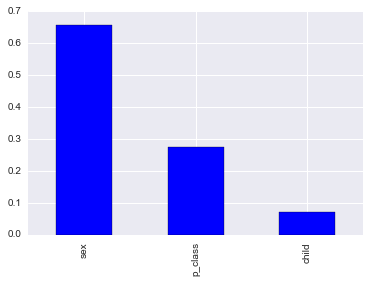

Example Usage: Titanic Dataset
==============================

An example of training a model on the titanic dataset.

The name of the package is **pandas-learn**, a mixing *pandas* into
*scikit-learn*. Therefore, you should always use pandas to handle your
data if you are using the package(!):

.. code:: python

    import pandas as pd
    %matplotlib inline

pandas-learn has an identical module structure to scikit-learn, so you
already know where to find all the models you already use:

.. code:: python

    from pdlearn.ensemble import RandomForestClassifier

You can use pandas to manipulate your data with ease:

.. code:: python

    data = pd.read_csv('titanic-train.csv')                   \
                     .append(pd.read_csv('titanic-test.csv')) \
                     .set_index('name')
            
    data['sex'] = data.sex == 'male'
    data['child'] = data.age.fillna(20) < 15
    X = data[['sex', 'p_class', 'child']].astype(int)
    y = data['survived']
    
    train = y.notnull()

.. code:: python

    X.head(10)

.. raw:: html

    

    <table border="1" class="dataframe">
      <thead>
        <tr style="text-align: right;">
          <th></th>
          <th>sex</th>
          <th>p_class</th>
          <th>child</th>
        </tr>
        <tr>
          <th>name</th>
          <th></th>
          <th></th>
          <th></th>
        </tr>
      </thead>
      <tbody>
        <tr>
          <th>Braund, Mr. Owen Harris</th>
          <td>1</td>
          <td>3</td>
          <td>0</td>
        </tr>
        <tr>
          <th>Cumings, Mrs. John Bradley (Florence Briggs Thayer)</th>
          <td>0</td>
          <td>1</td>
          <td>0</td>
        </tr>
        <tr>
          <th>Heikkinen, Miss. Laina</th>
          <td>0</td>
          <td>3</td>
          <td>0</td>
        </tr>
        <tr>
          <th>Futrelle, Mrs. Jacques Heath (Lily May Peel)</th>
          <td>0</td>
          <td>1</td>
          <td>0</td>
        </tr>
        <tr>
          <th>Allen, Mr. William Henry</th>
          <td>1</td>
          <td>3</td>
          <td>0</td>
        </tr>
        <tr>
          <th>Moran, Mr. James</th>
          <td>1</td>
          <td>3</td>
          <td>0</td>
        </tr>
        <tr>
          <th>McCarthy, Mr. Timothy J</th>
          <td>1</td>
          <td>1</td>
          <td>0</td>
        </tr>
        <tr>
          <th>Palsson, Master. Gosta Leonard</th>
          <td>1</td>
          <td>3</td>
          <td>1</td>
        </tr>
        <tr>
          <th>Johnson, Mrs. Oscar W (Elisabeth Vilhelmina Berg)</th>
          <td>0</td>
          <td>3</td>
          <td>0</td>
        </tr>
        <tr>
          <th>Nasser, Mrs. Nicholas (Adele Achem)</th>
          <td>0</td>
          <td>2</td>
          <td>1</td>
        </tr>
      </tbody>
    </table>
    

(Just in case you are wondering, Mrs. Nasser was apparently 14, so was
in fact a child despite being married!).

.. code:: python

    y.head(10)

.. parsed-literal::

    name
    Braund, Mr. Owen Harris                                0
    Cumings, Mrs. John Bradley (Florence Briggs Thayer)    1
    Heikkinen, Miss. Laina                                 1
    Futrelle, Mrs. Jacques Heath (Lily May Peel)           1
    Allen, Mr. William Henry                               0
    Moran, Mr. James                                       0
    McCarthy, Mr. Timothy J                                0
    Palsson, Master. Gosta Leonard                         0
    Johnson, Mrs. Oscar W (Elisabeth Vilhelmina Berg)      1
    Nasser, Mrs. Nicholas (Adele Achem)                    1
    Name: survived, dtype: float64

pandas-learn modules inherit directly from scikit learn models. They
have basically the same interface:

.. code:: python

    rf = RandomForestClassifier(n_estimators=500, criterion='gini')

When you fit to pandas data, it saves the feature and target names
automatically:

.. code:: python

    rf.fit(X[train], y[train]);
    print('Feature names: ', rf.feature_names_)
    print('Target names:  ', rf.target_names_)

.. parsed-literal::

    Feature names:  Index(['sex', 'p_class', 'child'], dtype='object')
    Target names:   Index(['survived'], dtype='object')

.. code:: python

    rf.predict(X[~train]).head(10)

.. parsed-literal::

    name
    Kelly, Mr. James                                0
    Wilkes, Mrs. James (Ellen Needs)                1
    Myles, Mr. Thomas Francis                       0
    Wirz, Mr. Albert                                0
    Hirvonen, Mrs. Alexander (Helga E Lindqvist)    1
    Svensson, Mr. Johan Cervin                      0
    Connolly, Miss. Kate                            1
    Caldwell, Mr. Albert Francis                    0
    Abrahim, Mrs. Joseph (Sophie Halaut Easu)       1
    Davies, Mr. John Samuel                         0
    Name: survived, dtype: float64

.. code:: python

    rf.predict_proba(X[~train]).head(10)

.. raw:: html

    

    <table border="1" class="dataframe">
      <thead>
        <tr>
          <th></th>
          <th colspan="2" halign="left">survived</th>
        </tr>
        <tr>
          <th></th>
          <th>0</th>
          <th>1</th>
        </tr>
        <tr>
          <th>name</th>
          <th></th>
          <th></th>
        </tr>
      </thead>
      <tbody>
        <tr>
          <th>Kelly, Mr. James</th>
          <td>0.881033</td>
          <td>0.118967</td>
        </tr>
        <tr>
          <th>Wilkes, Mrs. James (Ellen Needs)</th>
          <td>0.490276</td>
          <td>0.509724</td>
        </tr>
        <tr>
          <th>Myles, Mr. Thomas Francis</th>
          <td>0.918252</td>
          <td>0.081748</td>
        </tr>
        <tr>
          <th>Wirz, Mr. Albert</th>
          <td>0.881033</td>
          <td>0.118967</td>
        </tr>
        <tr>
          <th>Hirvonen, Mrs. Alexander (Helga E Lindqvist)</th>
          <td>0.490276</td>
          <td>0.509724</td>
        </tr>
        <tr>
          <th>Svensson, Mr. Johan Cervin</th>
          <td>0.659940</td>
          <td>0.340060</td>
        </tr>
        <tr>
          <th>Connolly, Miss. Kate</th>
          <td>0.490276</td>
          <td>0.509724</td>
        </tr>
        <tr>
          <th>Caldwell, Mr. Albert Francis</th>
          <td>0.918252</td>
          <td>0.081748</td>
        </tr>
        <tr>
          <th>Abrahim, Mrs. Joseph (Sophie Halaut Easu)</th>
          <td>0.490276</td>
          <td>0.509724</td>
        </tr>
        <tr>
          <th>Davies, Mr. John Samuel</th>
          <td>0.881033</td>
          <td>0.118967</td>
        </tr>
      </tbody>
    </table>
    

.. code:: python

    rf.feature_importances_.plot.bar()

.. parsed-literal::

    <matplotlib.axes._subplots.AxesSubplot at 0x10ea158d0>

